# MC (1): fundamentals

## The blue patch code

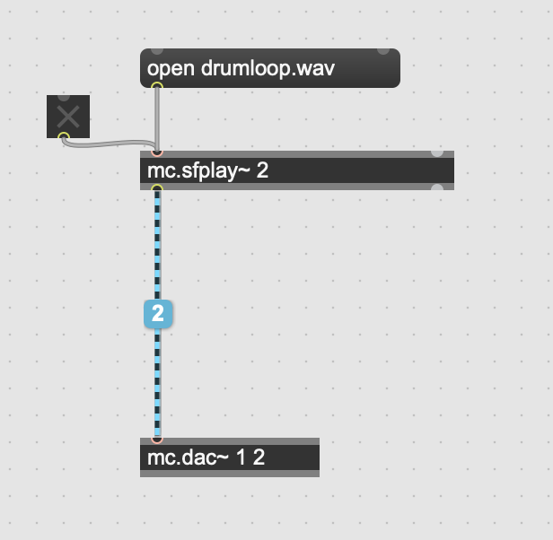

yellow patch code ... 1 ch  
blue patch code ... x channels (hovering over the cord shows the number of channels)

### mc.pack~ and mc.unpack~
 
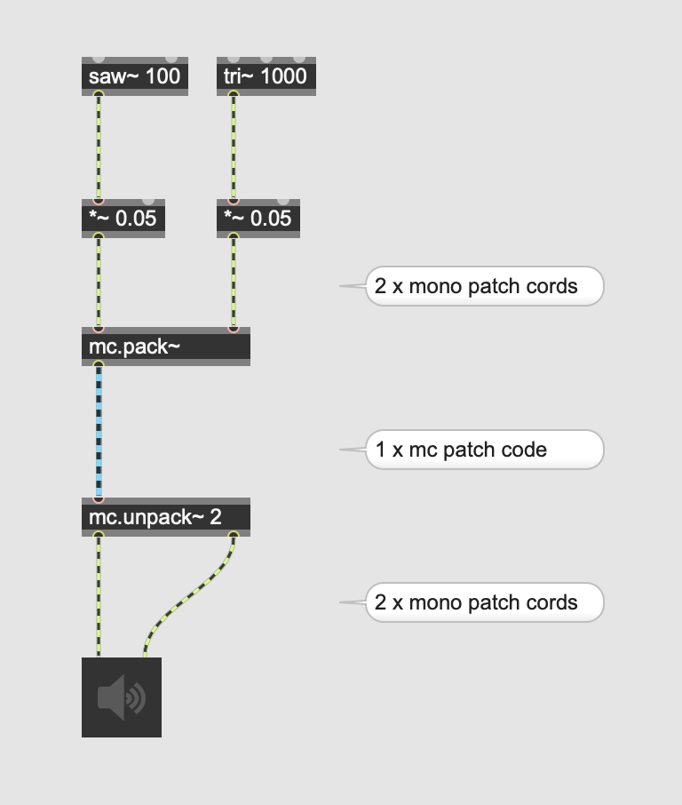

### monoralize

### duplication

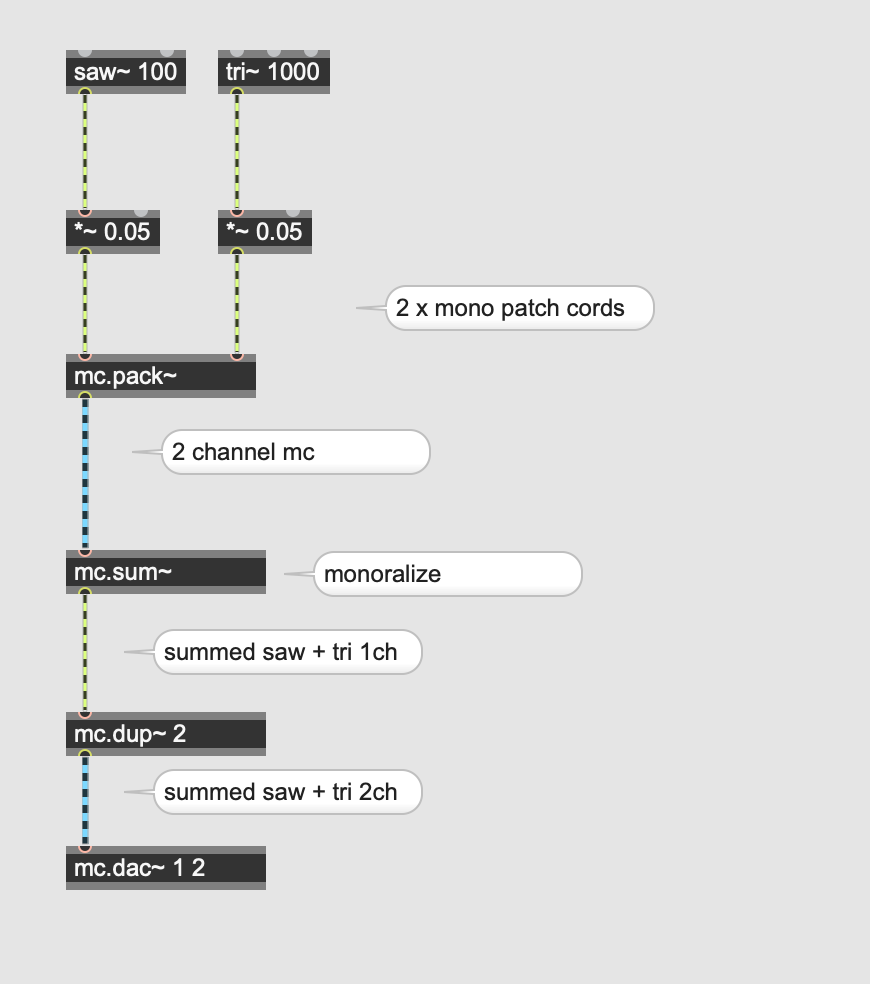
 
### effect
 
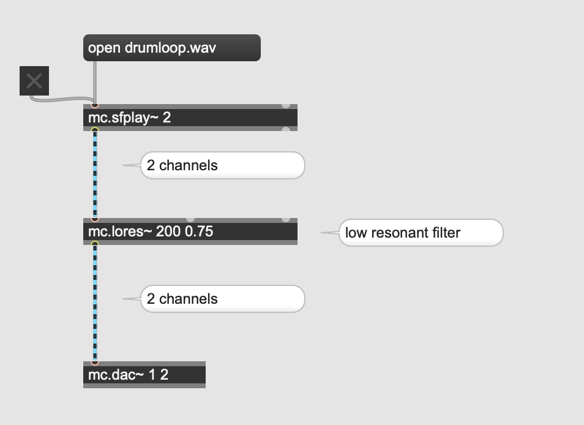
 
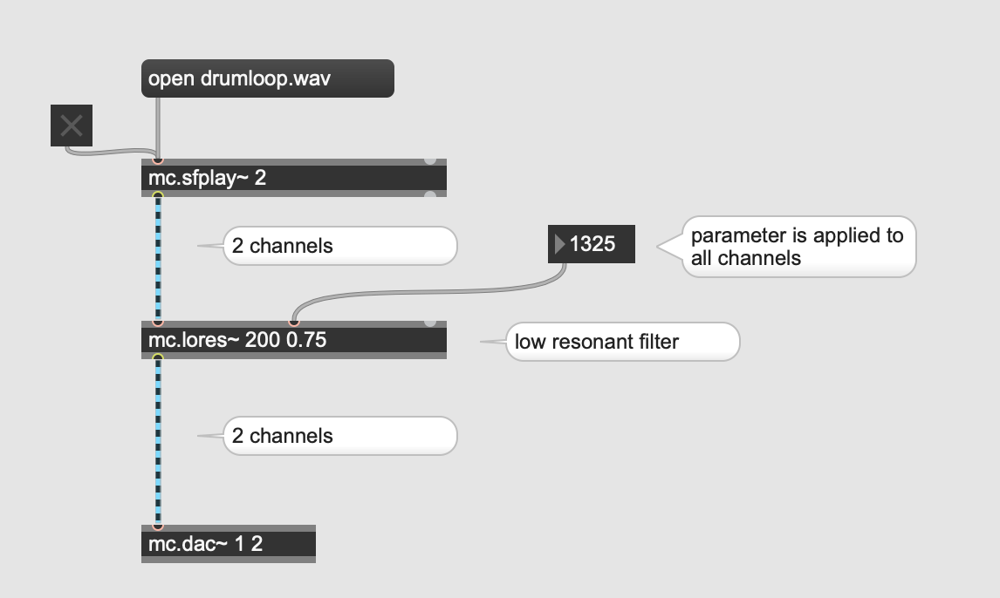

### meter~ 

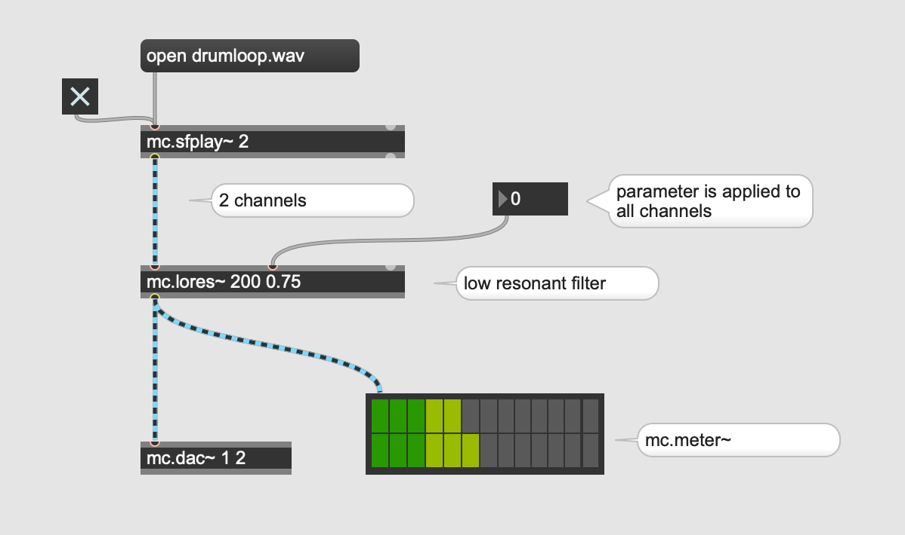
 
### gain~

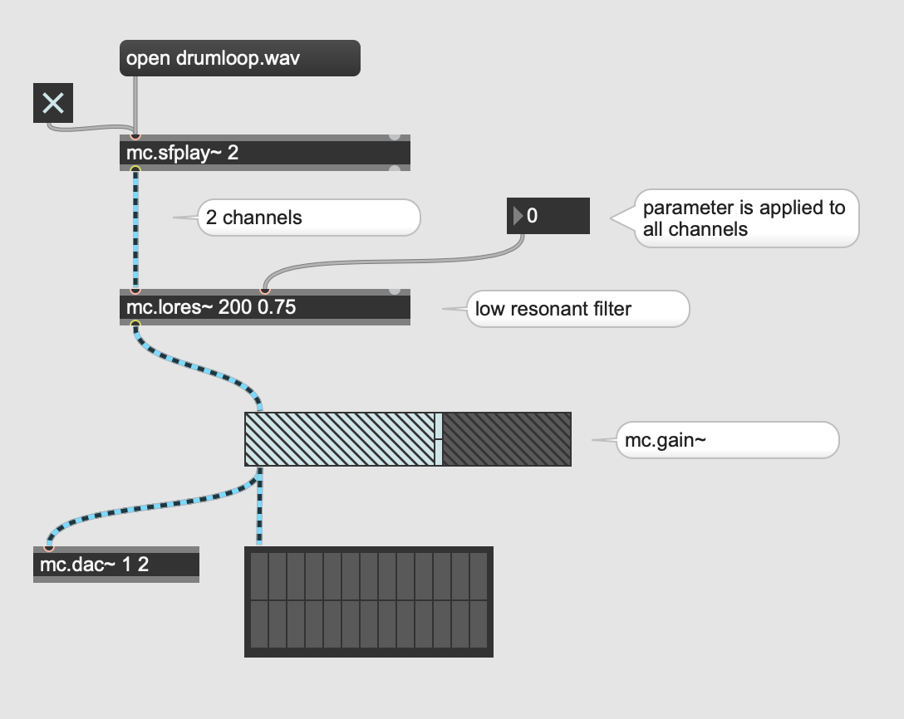

## Assignment 1

[Here](senita-8ch.wav) is an 8 channel sound file. Monoralize all channels and send the monoralized signal to all speakers. You are allowed to use max. 6 objects including mc objects to complete this assignment.

### individual control

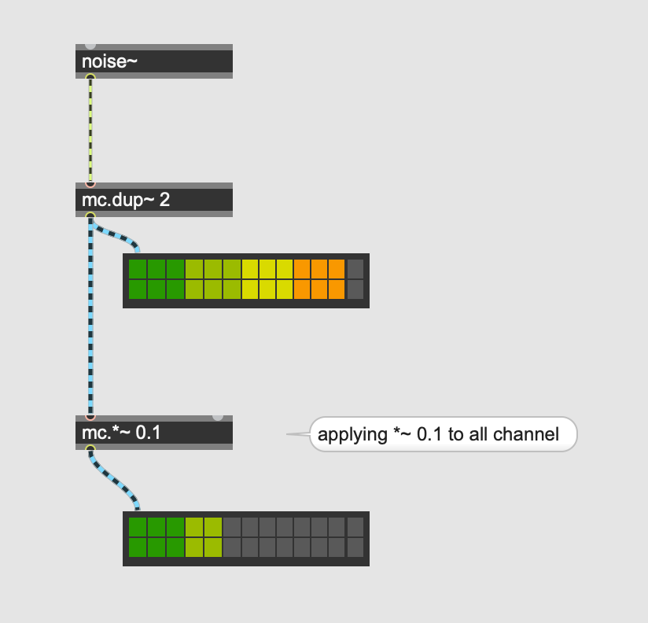

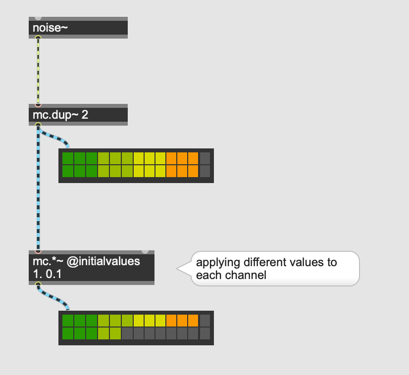

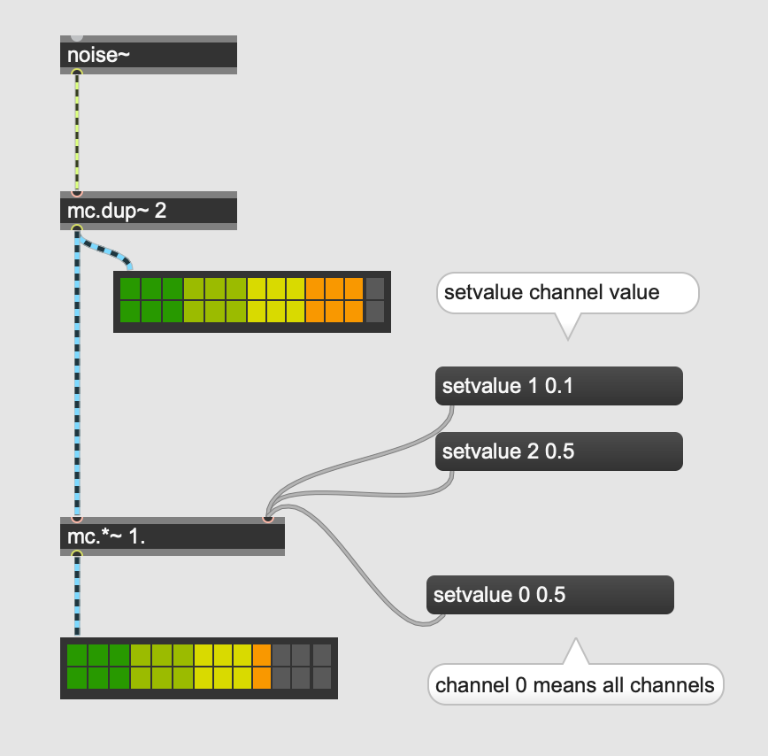

## Assignment 2

Create a patch that send four sawtooth waves with four different frequencies to the both left and right speakers of your laptop. You are allowed to use max. 4 objects.

hint: @chans

### mc.target

just a message generator

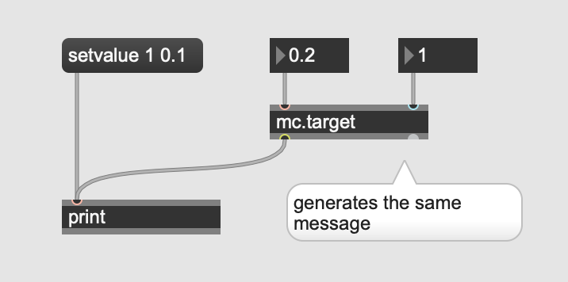

### applying mc.target 

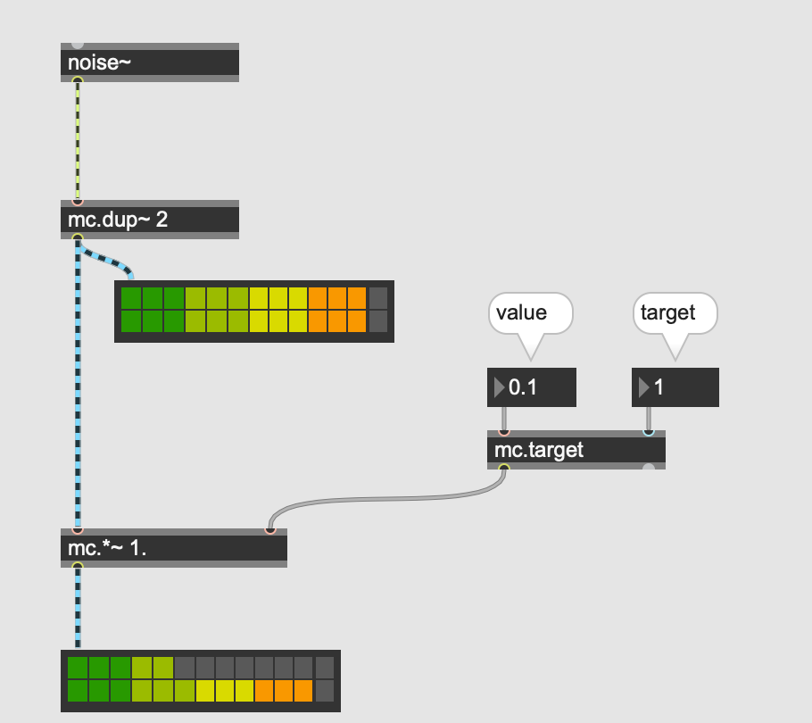

### mc.targetlist

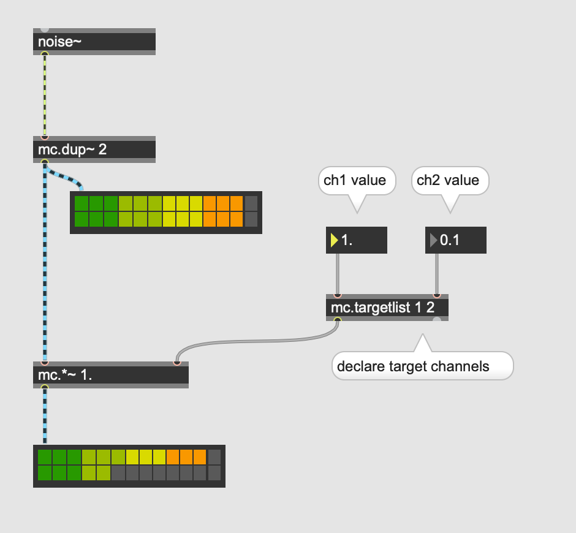

### applying mc.targetlist
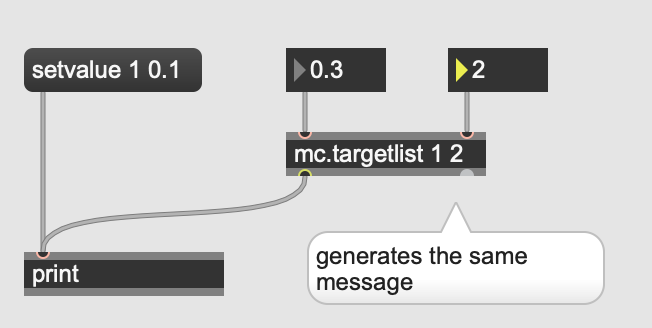

## Assignment 3

Create a patch that send the following audio sample to 8 speakers with different delay time between 0 and 500 ms. The delay time applied to each channel (speaker) should be controllable by 8 sliders in the patch. You must use one mc.targetlist in your solution.

[Audio Sample](eight.wav)

Hint: mc.delay~

### mc.list~
outputs a multichannel signal with fixed values

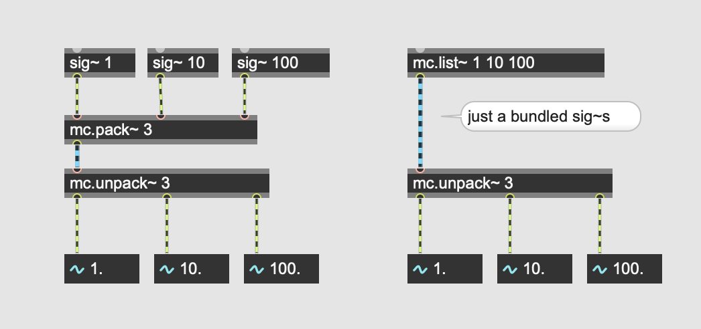

## Assignment 4

Create a patch that realizes the additive sysnthesis up to 8 harmonics using mc.list~.
The fundamental frequency is fixed to 100. The amplitude of each harmonic should be controlable by sliders.

### mc.range~
outputs a mulltichannel signal with fixed values generated by the given parameters

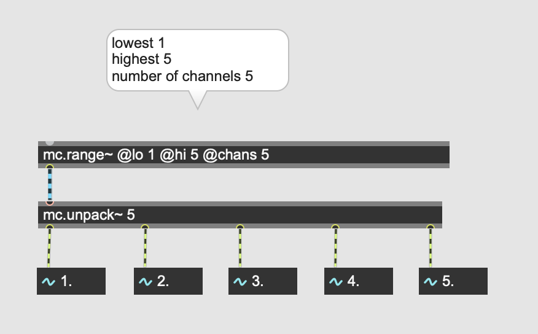

## Assignment 5
Reimplement Assignment 4 using mc.range~