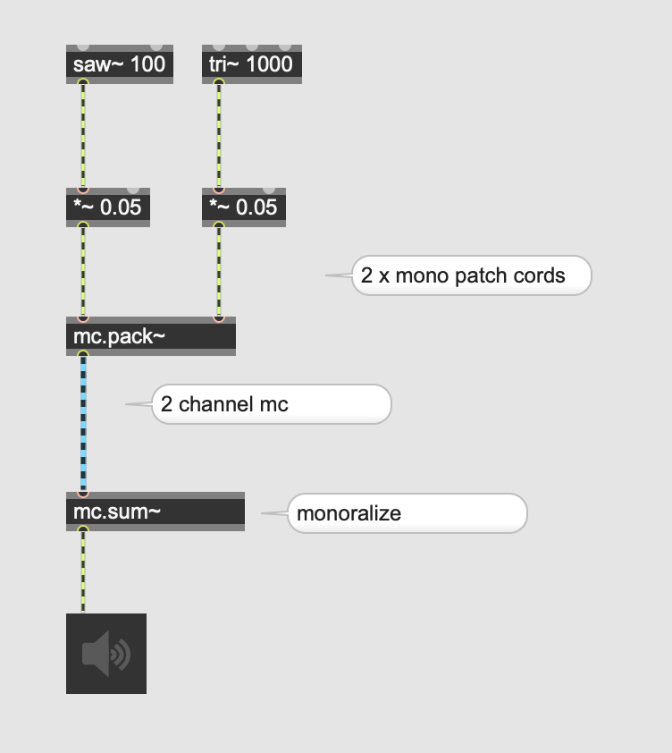

# MC = multi channel

## The blue patch code

yellow patch code ... 1 ch  
blue patch code ... x channels (hovering over the cord shows the number of channels)

### mc.pack~ and mc.unpack~
 

### monoralize

### duplication

 
### effect
 

 

### meter~ 

 
### gain~

## Quiz 1

[Here](senita-8ch.wav) is an 8 channel sound file. Monoralize all channels and send the monoralized signal to 8 speakers. You are allowed to use max. 6 objects to complete this assignment.

