# MC (2): Manipulating channels

## Grouping / Ungrouping

### mc.pack~ /  mc.unpack~
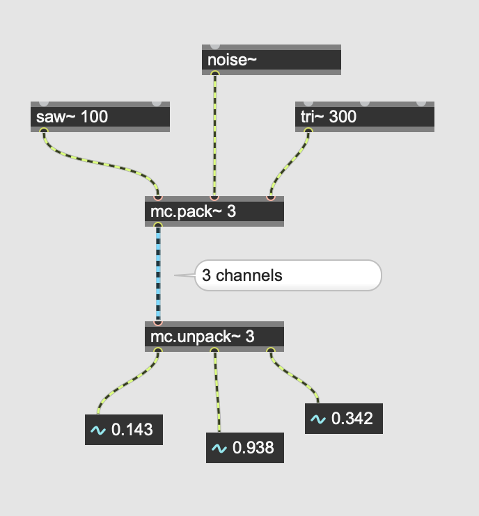

### mc.combine~ / mc.separate~
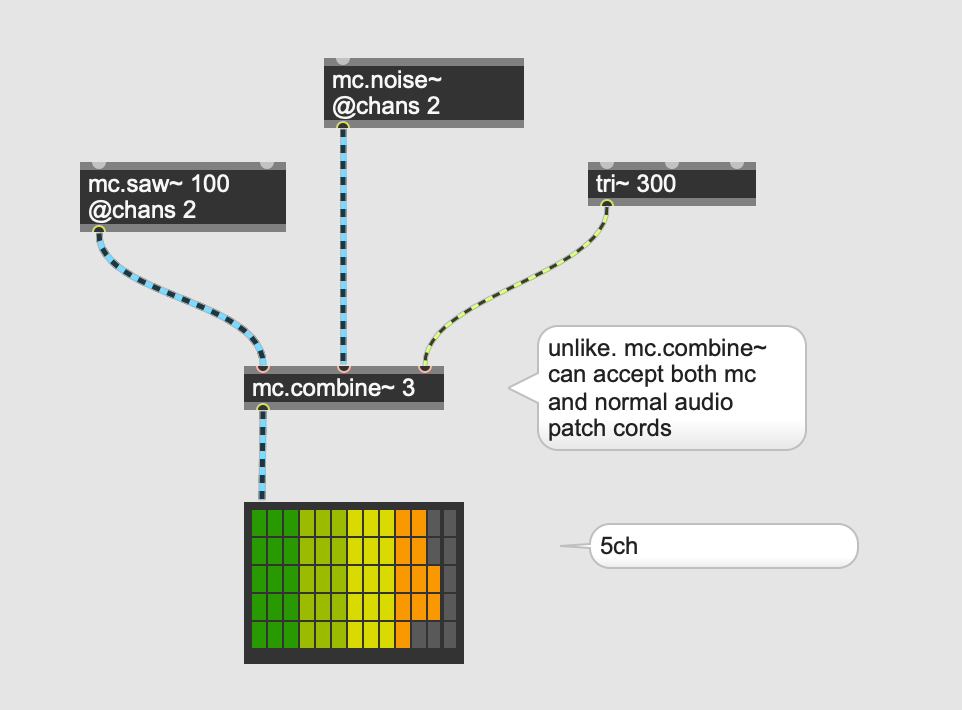

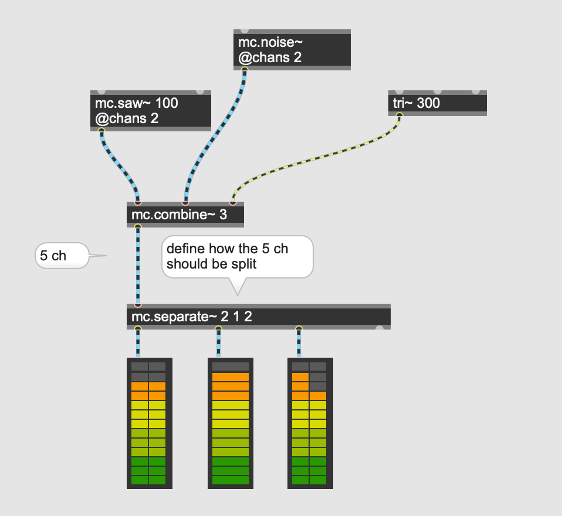

## Assignment 1

Download the 5.1 channel file from [here](./horror.wav).   
Mix down all channels for the front speakers to the left channel, for the back speakers to the right channel, and LFE to the both.

Hint: the channel order of 5.1

1: left  
2: right  
3: center  
4: LFE  
5: left surround  
6: right surround  

## Mix down
### mc.sum~ : monoralize

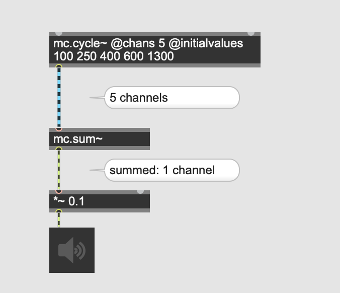

### mc.stereo~ : stereonize

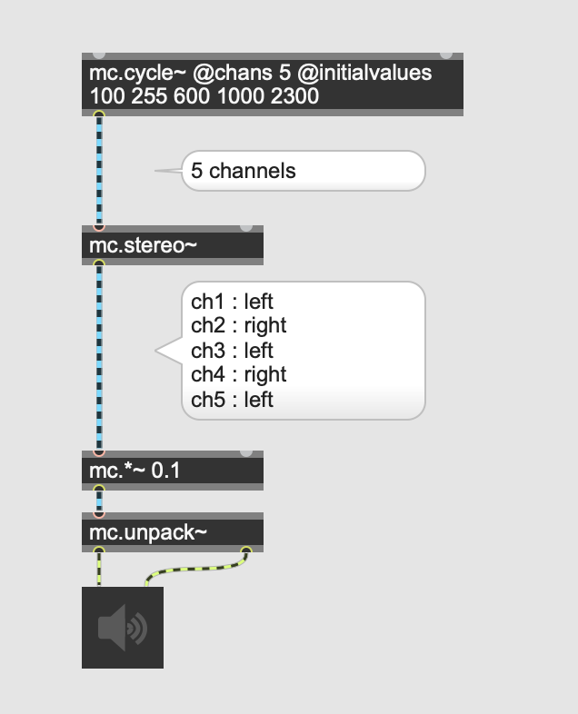

### panning with mc.stereo~

The right inlet of mc.stereo~ allows us to pan between left (0) and right (1).

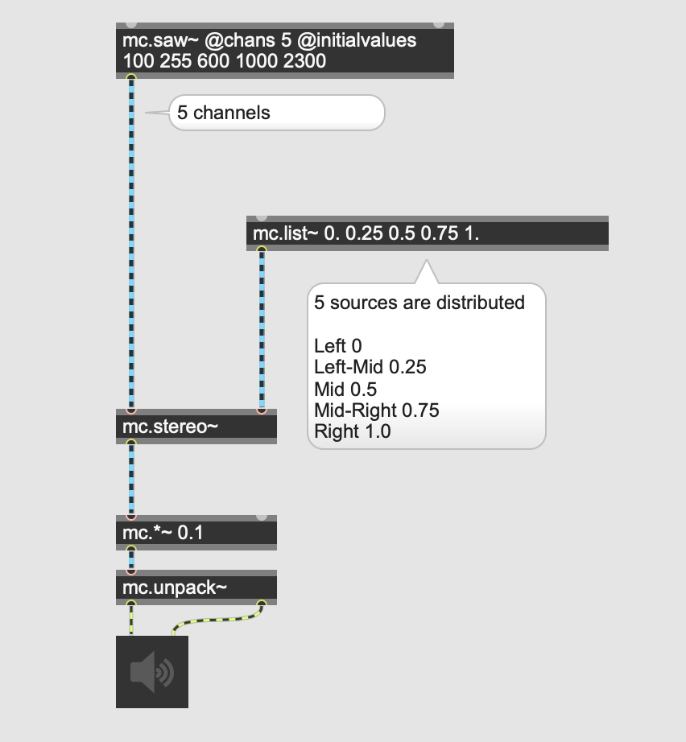

### Assignment 2
Extend the above patch (panning with mc.stereo~) and make all 5 instances saw~ auto panned between hard-left and hard-right continuously with different speed.

### mc.mixdown~ : more flexible compared to sum~ or stereo~

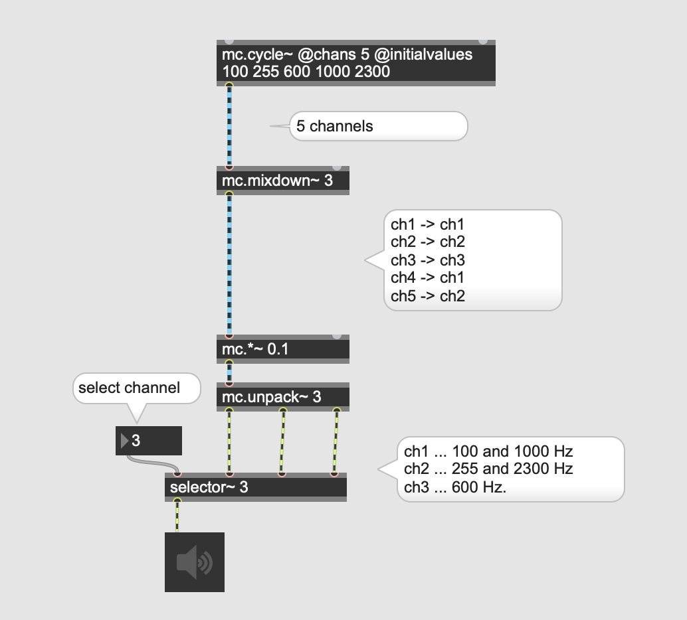

### Assignment 3

Create a patch that process white noise with 24 different resonant bandpass filters (reson~) with randomly chosen different center frequencies. 

In 8 channel surround speaker setup, send outputs of 3 bandpass filter to each speaker so that each speaker receives summed signal from 3 filters.

You are allowed to use max. 5 tilde objects to solve this quiz

Hint: use 100 for cue value of the reson~ and 1 for the gain value of the reson~  
Hint: Learn Uzi to generate 24 different random numbers

### mc.interleave~ : interleave two or more sources

### What is interleaving?
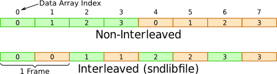

.wav files for example contain interleaved samples.

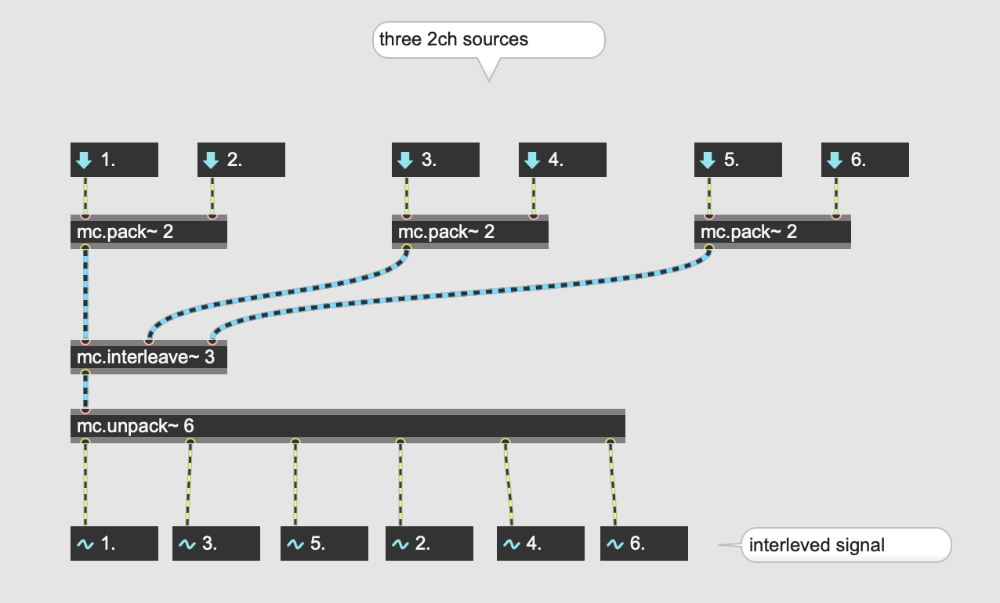

### mc.deinterleave~

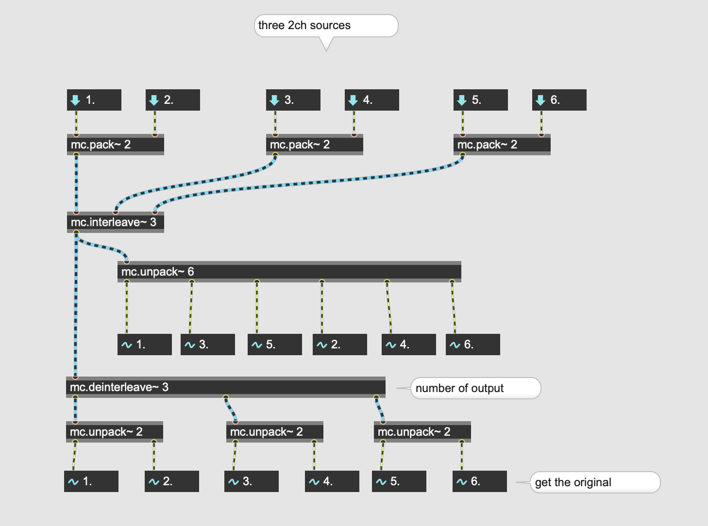

### application : Why is this useful?

mc.play~ outputs 
- N * duplicated L channels from the left outlet
- N * duplicated R channels from the right outlet

here is what's going to happen after mc.interleve~ 2  

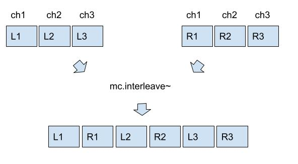

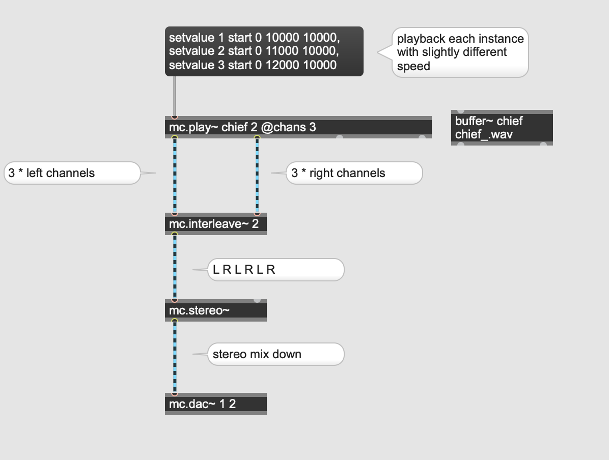

### Assignment 4

[Stereo files](K2/stereo_samples.zip)

Playback the 4 stereo files in loop using 4 playlist~ and send them to the 8 speakers in the following manner.

- Speaker 1 : FileA-Left
- Speaker 2 : FileB-Left
- Speaker 3 : FileC-Left
- Speaker 4 : FileD-Left
- Speaker 5 : FileA-Right
- Speaker 6 : FileB-Right
- Speaker 7 : FileC-Right
- Speaker 8 : FileD-Right

use only mc object + 1 toggle for the implementation

