# MC (3): evolve and gradient

## mc.evolve~

### multirange object

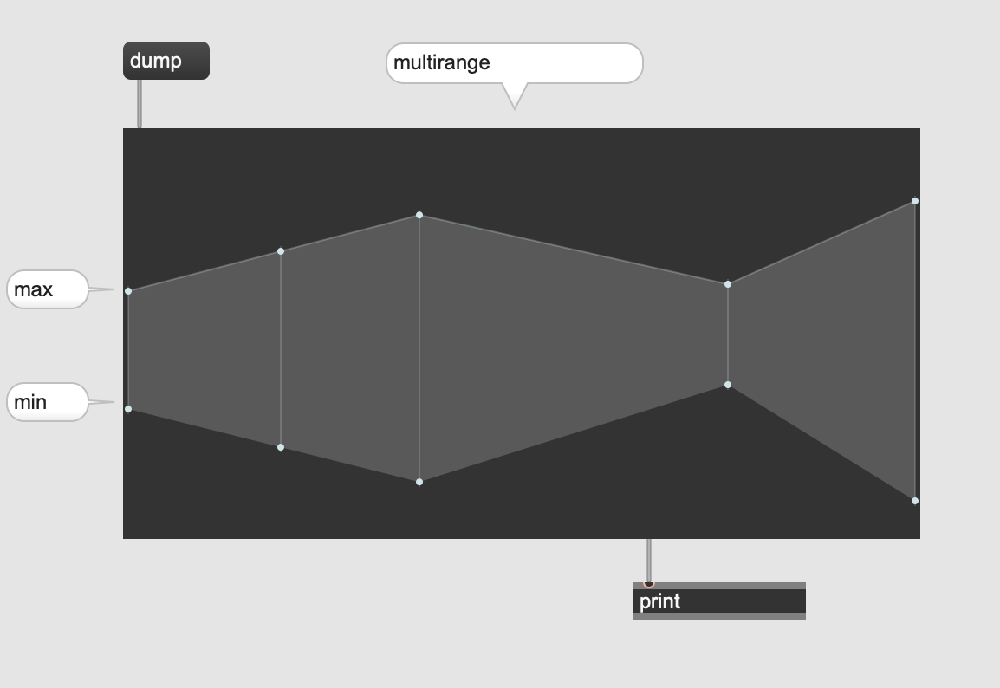

This graphical interface allows us to set up gradually changing range of value.

### range look-up

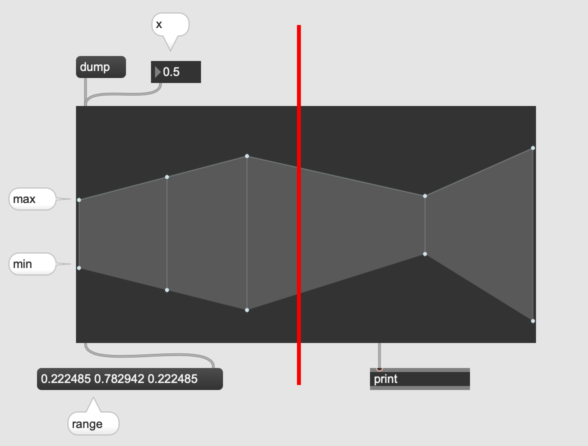

### mc.evolve~

requires what multirange outputs and distribute equally distributed values between min and max by giving it the x value.

#### what it means

equally distributed values between min and max.

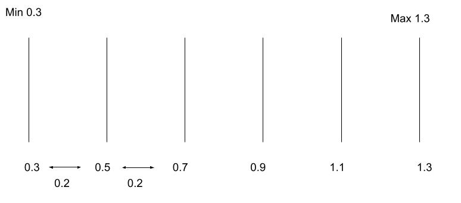

### demonstration

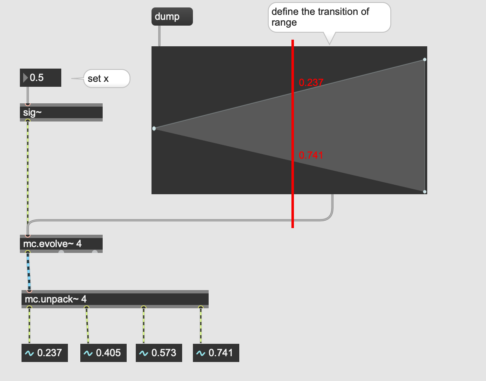

each channel contains equally distributed value between the current min and max value determined by x value

### application

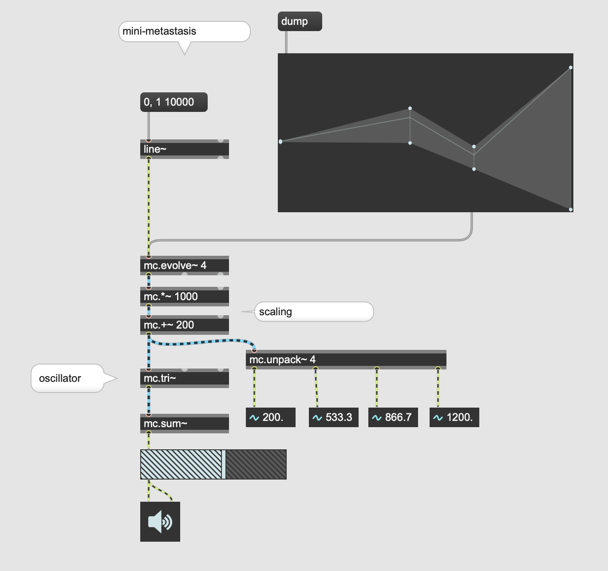

### Assigment 1

Use mc.evolve~ and multirange to control the speed of 8 instances of groove~ that playback the audio sample below

[Audio Sample](K3/eight.wav)

## mc.gradient~

outputs y value according equally distributed x value.

### Simple function

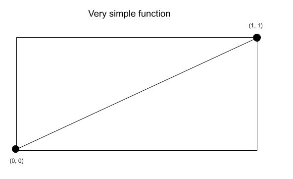

### Reading with mc.gradient~

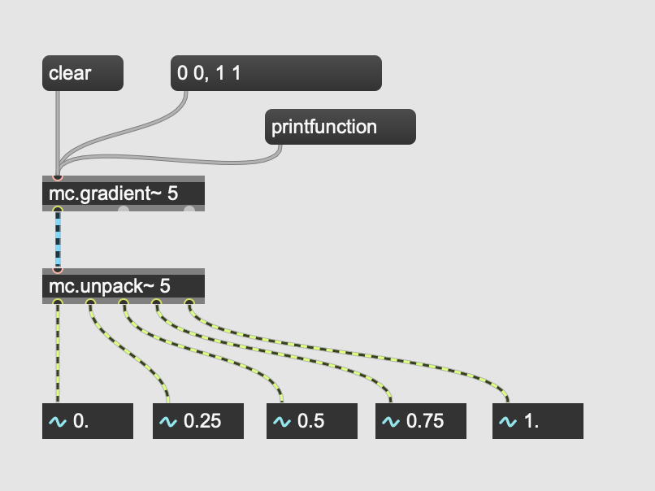

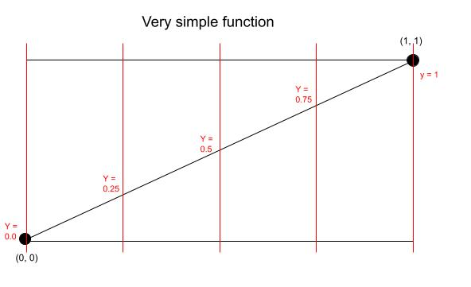

### Quiz 1

What outputs from mc.unpack~ 5 do we expect, when the message "0 0, 1 1" is changed to "0 1, 1 0"?

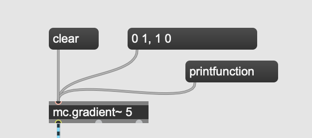

### Interpolating two Y values

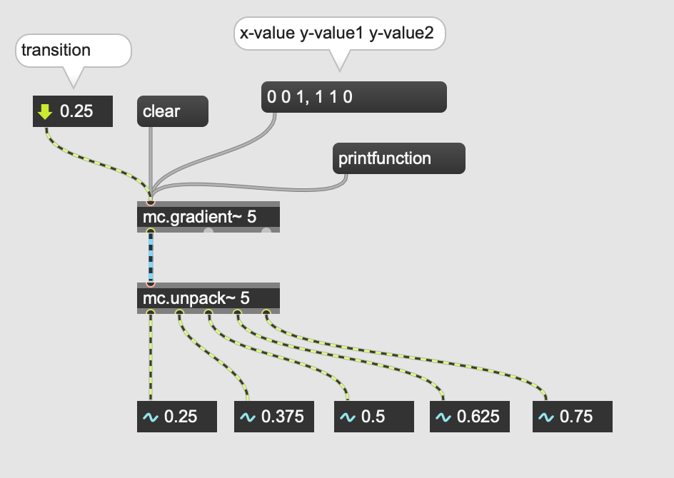

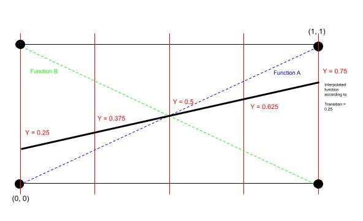

### application: Additive Sysnthesis control

By using this gradient we could program the transition of overtones

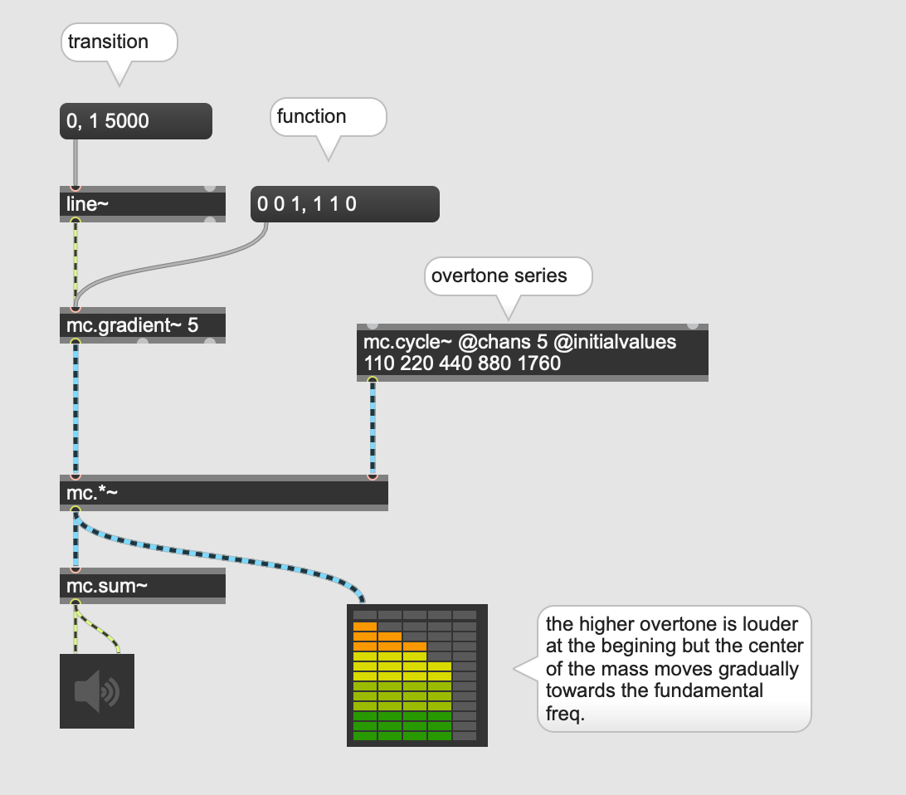

### Assignment 2

Create a patch that applies the technique introduced above for filtering.
E.g. you can loop some samples and apply 5* bandpass filter to it. Each bandpass filter has a fixed center frequency but the gain of the filters are controlled dynamically by the mc.gradient~.
