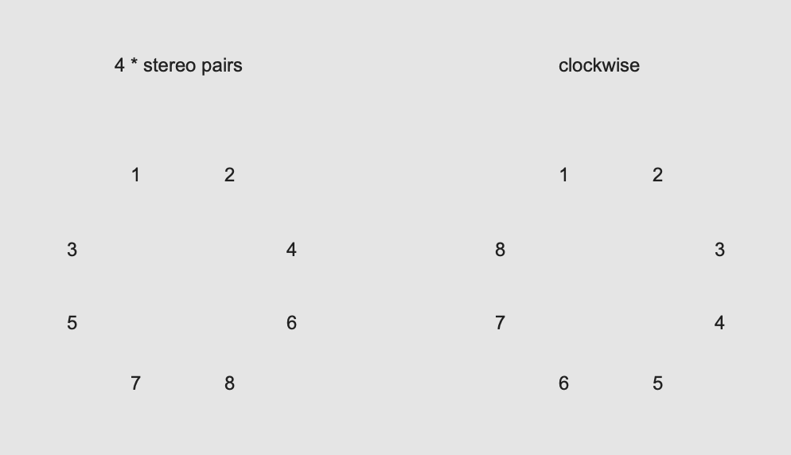

# K3: 8 Channel system

### Speaker Layout

[Octaphonic system](https://en.wikipedia.org/wiki/Octophonic_sound)

### Testing Speaker System
It is always important to test briefly that all speakers outputs sound as you intended before you rehears your multi-channel piece.

## Quiz 1
Create a patch that output white noise from channel 1 to 8 one by one for 1 second by clicking one bang in order to test the 8 channel system.

## Stereo Panning

## Linear and Power Panning

## Quiz 2 extending it to 4 channels

## Quiz 3 extending it to 8 channels
