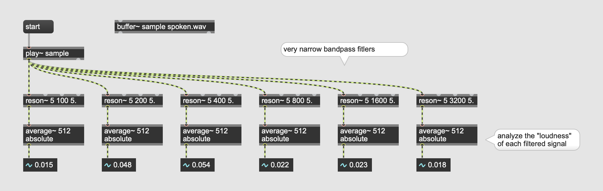
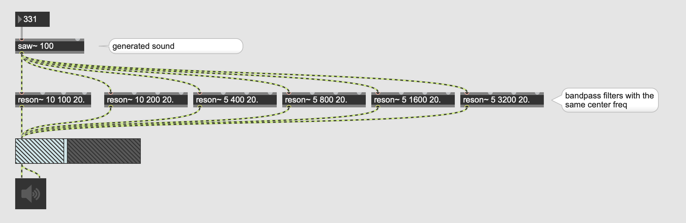
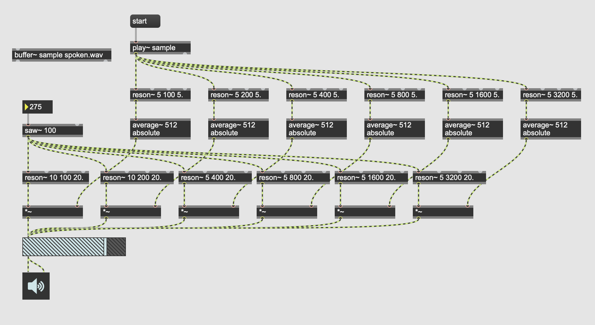

# MC (4): The vocoder project

## Vocoder

[Example](https://www.youtube.com/watch?v=0kEHP2aUItA)

### Bandpass + Analyzer

### Synthesize

### Combination

Assignment: Use MC and simplify the vocoder patch. Use only MC object (excluding GUI objects) and the number of mc objects used should be less than 10.

