# K5: 8 Channel system

### Speaker Layout

[Octaphonic system](https://en.wikipedia.org/wiki/Octophonic_sound)

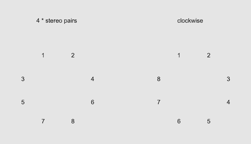

### SFEM Speaker Layout

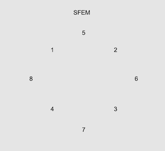

There is practically no standard-order for speaker layout.  We need to often adjust our sound files to the system.

### mc.resize~

mc.resize~ resizes the mc channel streams to the specified channel count.
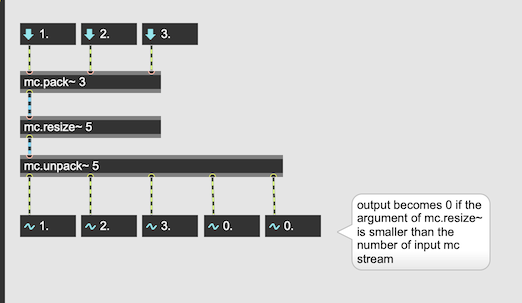

#### replicate

"@replicate 1" forces mc.resize~ to repeat the input if the designated channel is greater than the number of input channels. 

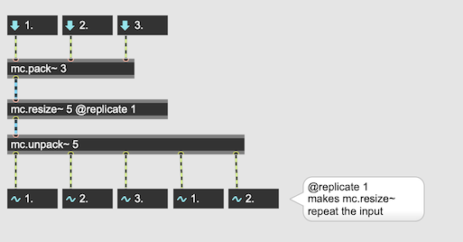

#### select

@select allows us to freely re-order the input channel. This means, mc.resize~ can be used just for reodering channels.

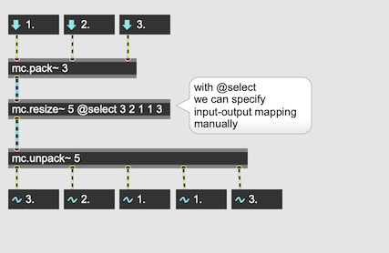

## Assignment 1

[clockwise.wav](K5/clockwise.wav)

Download the following 8 channel file whose channel order is clockwise and map it to SFEM the setup. If the mapping is successful, each speaker tells its own channel number. For this assignment you must use mc.resize~

## Revisiting Panning Low

[Panning Low](http://sig.sapp.org/doc/classes/Pan/overview.html)

### Linear Panning

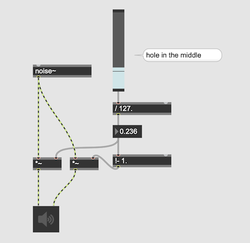

### Constant Power Panning

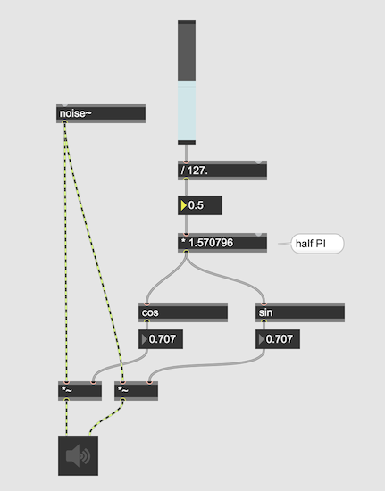

## How pan2S implements Constant Power Panning 

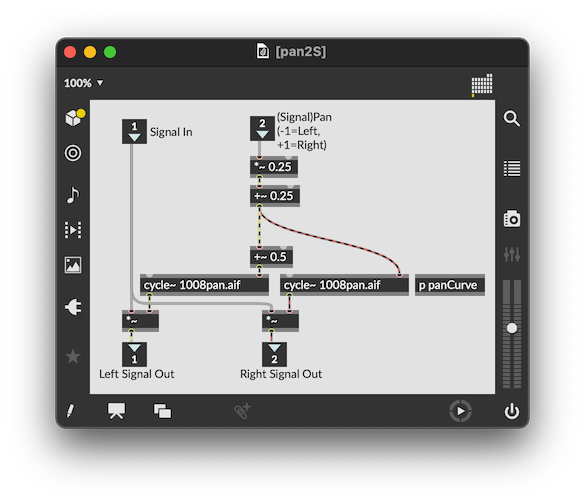

- cycle~ can be used as play~ or wave~
- storing a pan curve in a buffer 
- look it up using cycle~
- Both L and R channels look up the same buffer~ but with a fixed distance = 0.5 

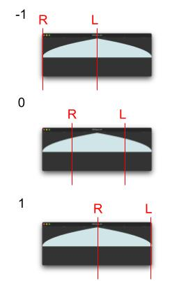

### Step by step explanation

#### 1. sine wave rendering
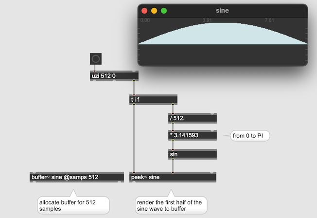

#### 2. table look-up using cycle~
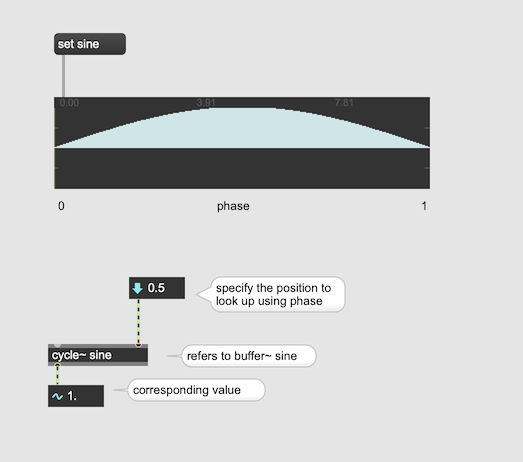

#### 3. visualization
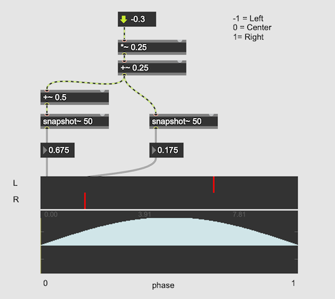

## Assignment 2

Extend our pan2S patch and implement pan4S. 

### Hint

The principle is same as Pan2S but the source should appear only between 2 speakers. The other speaker should mute.

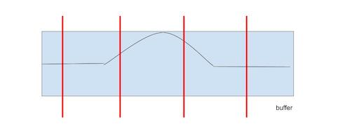

## Assignment 3

Extend our pan4S to pan8S and simplify the patch using mc.

