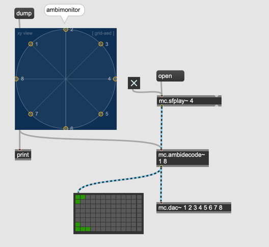

# Spatialization using Ambisonics (1)

## Ambisonics
A technology to store/stream spatial audio without defining the output format such as stereo, quad, 5.1, 8 or 16 channels.

This is helpful when you want to compose your surround music using 4 channel setup in the studio and playback it in a good concert hall with 16 speakers.

In addition to that, you can simulate the surround speaker setup using headphones. It means you can draft your music using headphones and master it in a studio.

## Sound Field Microphone

enables you to record sound in Ambisonics format.

## Is ambisonics recording available online?

[Ambisonic sound library by Rode](https://library.soundfield.com/)

## How to use Ambisonics in Max?

### ICST Ambisonics Plugin
[ICST Ambisonics External Plugin](https://www.zhdk.ch/forschung/icst/software-downloads-5379/downloads-ambisonics-externals-for-maxmsp-5381)

### Listening to downloaded ambisonics file properly using 4 speakers

sink ... a 3D point in the virtual sound field to be used for decoding. Usually these points coincide with the speakers in the real world.

### 8 channel speaker decoding

### mc version is available

### monitoring of ambisonics with headphones

### spatialization using ambisonics

### Specifying the position by message

## Assignment 1:

Make a patch that moves white noise in an A-shape as illustrated below in 10 seconds.

Hint: use line to interpolate x and y

## Assignment 2:

- Download the following three files. 
- In a patch, play all of them in an endless loop and rotate the position of them using the listener's position as a pivot as illustrated below
- Place three sources in three different distances and rotate them at three different speeds.
- One of the three sources should be rotated clockwise and the rest should be counterclockwise

[sample download](compress.zip)
