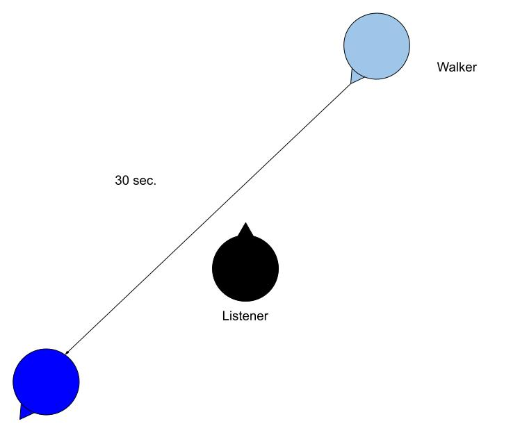

# Spatialization using Ambisonics (2)

## 

## Assignment: Footsteps passing by

use the following footstep audio sample and design the audio scene that a person passing by your position in 30 seconds using Ambisonics. Try to maximize the distant - near - distant effect by processing sound using filter and reverb.

[Footstep.wav](K7/footstep.wav)

- Reverb
- Filter
- Amplitude 
- Ambisonics

