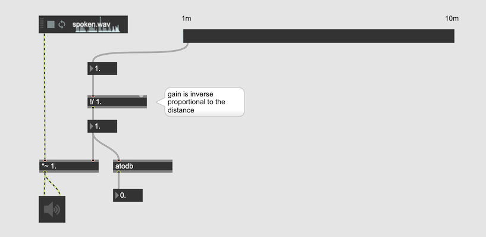

# Spatialization using Ambisonics (2)

## Distant Cue

- Soft / attenuated -> gain
- High frequency component travels less -> Low Pass or Low Shelf
- Unfocused due to the reflections from the walls and reverb -> Reverb

## Simulation of distance

### gain
soft sound is the initial cue for the distant sound

### lowpass

Air and any obstacles reduces the higher frequency component more significantly than lower frequency component.

[Code & Sound](https://codeandsound.wordpress.com/2014/08/21/absorption-of-sound-by-air-and-its-implementation-as-a-filter-part-1-theory/)

### reverb
wet/dry balance produces the distant sound

[OrilRiver a free VST Reverb](https://www.kvraudio.com/product/orilriver-by-denis-tihanov/downloads)

### How Game Sound Designer creates distant effect

mapping filter and volume and stereo spread (or reverb) to the distance parameter.

### The relationship between distance and gain

In acoustics, the sound pressure of a spherical wavefront radiating from a point source decreases by 50% as the distance r is doubled; measured in dB, the decrease is still 6.02 dB, since dB represents an intensity ratio. The pressure ratio (as opposed to power ratio) is not inverse-square, but is inverse-proportional (inverse distance law):

### gain and distance

### Assignment 1: mapping the distance

In the above patch that maps distance and gain, map also low pass and the distance slider and reverb ratio and the distance slider to your liking.

## Spatial Sound = you have to master reverb

### Components of reverb

Reverb consists of three parts
- Direct Sound
- Early Reflections ... , the initial a few clear bounces of sound from the walls. Very important cue for recognizing the size of the room and the distance to the sound source.
- Reverb (Tail) ... The rest of the reverb that comes after ER.
  

#### Pre Delay
The interval between Direct sound and the first early reflection. Pre-delay gives us a certain clue to the **size** of the room; in larger rooms the pre-delay is longer as it takes more time for reflections. Pre-delay also gives a clue to the **distance** between the source and the listener, the closer the source to the listener the long the pre-delay.

#### Early Reflections

> Early Reflections provide our brain with most of the information regarding space properties and will contribute greatly to the realism of depth.

- The **Level** of the ER suggests 
  - how big the room is. Softer reflection means the room is bigger because the sound has to travel longer to come back.
  - The surface materials. Concrete wall reflects more than the wall with curtains.
  - The distance to the sound source, the louder the reflection is the farther the sound source

#### Depth and reverb ratios

> Depth positioning during mixdown is commonly achived by different level ratios between the dry sound and the reverb

## Assignment : Footsteps passing by

Use the following footstep audio sample and design the audio scene that a person passing by in 30 seconds using Ambisonics. Try to maximize the distant - near - distant effect by processing sound using filter and reverb.

[Footstep.wav](K7/footstep.wav)

